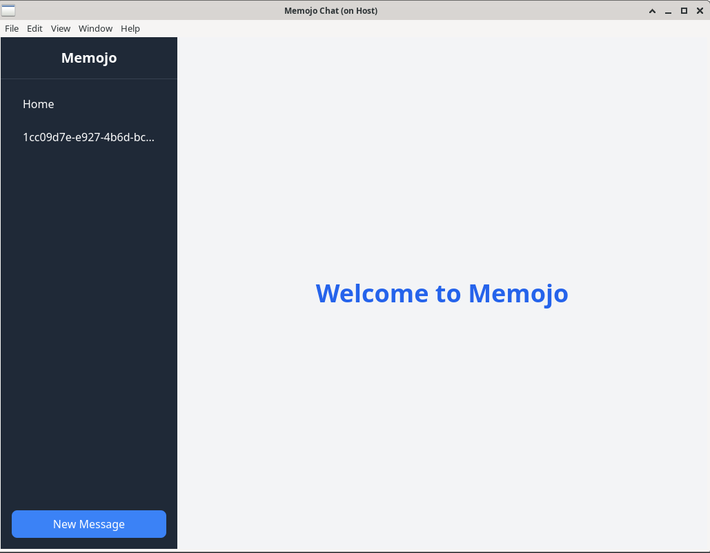
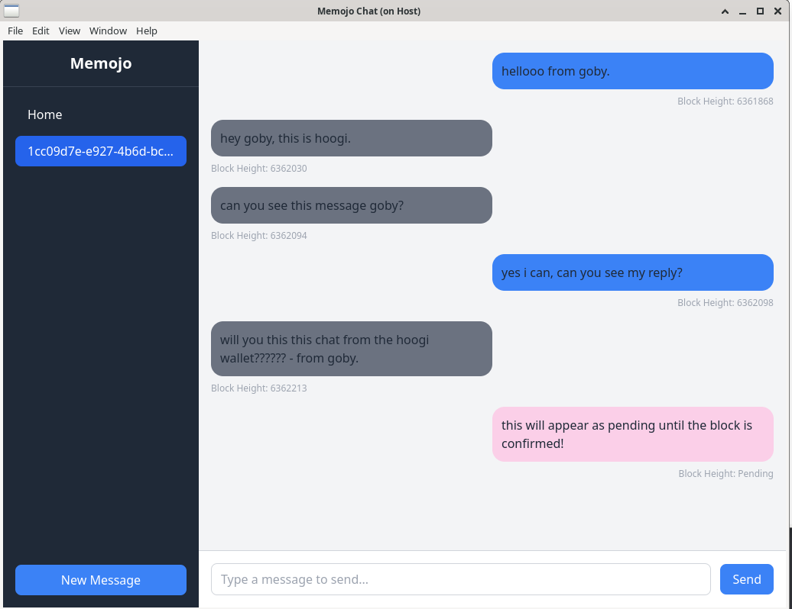
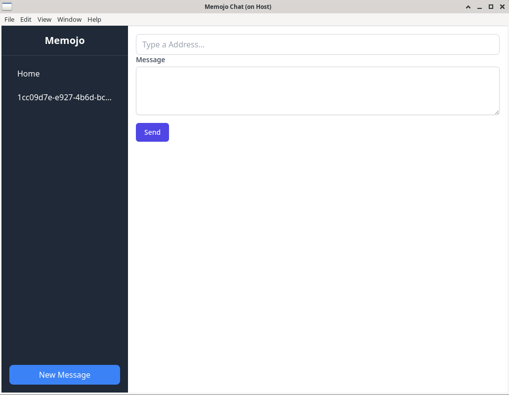

# Memojo

Communicate with chia wallets using microtransaction memos.

## Screenshots

## Security Warnings

**This is not secure messaging**

In the current application, messages within Chia transactions are embedded in JSON objects and identified by a ChatId. The application groups these messages based on the ChatId alone, regardless of the sender's identity. This method of grouping **presents a significant security issue**: it allows multiple different wallets to send messages that appear to be from the same chat.

# Requirements

- Chia Full Node Fully Synced
- Chia Wallet RPC Running
- NodeJS (version developed on v21.7.1)

# Setup

- Make sure chia wallet and chia full node is running.
- npm start node
- npm start wallet
- Ensure node is fully synced
- Review **package.json** appConfig section ensuring the URLs are correct for the rpcs. These are used for communicating with the rpc endpoints to fetch & send transactions.
- run npm install
- **npm run start:dev** or **npm run electron**

This simple PoC requires access to your wallet & node certificates and certificate keys in order to show transactions and post transactions with memos attached.

# contributing

- PRs are welcome
